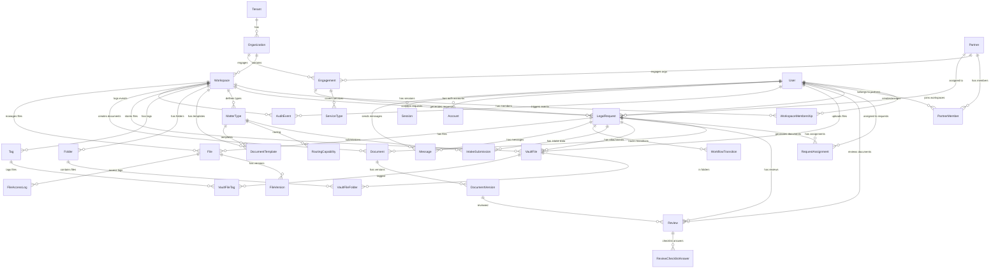

# Database Analysis Report

**Generated:** 2026-06-17
**Database:** SQLite (PhapChe Legal Platform)

---

## 1. Entity Relationship Diagram (Mermaid)



---

## 2. Current Schema Summary

### 2.1 Core Tables

| Table | Records | Purpose |
|-------|---------|---------|
| User | 202 | Platform users (staff & customers) |
| Tenant | 1 | Platform tenant |
| Organization | 11 | Customer organizations |
| Workspace | 15 | Legal workspaces per org |
| WorkspaceMembership | 216 | User-Workspace relationships |

### 2.2 Request Management

| Table | Purpose |
|-------|---------|
| LegalRequest | Legal cases/requests |
| RequestAssignment | User assignments to requests |
| IntakeSubmission | Draft intake form data |
| WorkflowTransition | Status change history |

### 2.3 Partner & Engagement

| Table | Purpose |
|-------|---------|
| Partner | Law firms/consultancies |
| PartnerMember | Partner-user relationships |
| Engagement | Partner-Organization contracts |
| ServiceType | Types of legal services |
| EngagementServiceScope | Service permissions |

### 2.4 Document & Review

| Table | Purpose |
|-------|---------|
| Document | Generated documents |
| DocumentVersion | Document versions |
| DocumentTemplate | Document templates |
| Review | Document reviews |
| ReviewChecklistAnswer | Checklist answers |

### 2.5 Vault & Storage

| Table | Purpose |
|-------|---------|
| VaultFile | File attachments |
| Folder | File organization |
| Tag | File tagging |
| VaultFileFolder | File-folder mapping |
| VaultFileTag | File-tag mapping |
| File | General file storage |
| FileVersion | File versions |
| FileAccessLog | Access audit |

### 2.6 Audit & Communication

| Table | Purpose |
|-------|---------|
| AuditEvent | Action logging |
| Message | Request comments |

### 2.7 Auth

| Table | Purpose |
|-------|---------|
| Account | OAuth accounts |
| Session | Active sessions |
| Verification | Email verification |
| UserPreferences | User settings |

---

## 3. Issues & Optimization Recommendations

### 3.1 HIGH PRIORITY

#### Issue 1: Missing `userType` Field
**Problem:** Cannot distinguish between staff and customers without querying memberships.
```sql
-- Current: Need to check memberships to determine user type
SELECT * FROM WorkspaceMembership 
WHERE userId = ? AND role != 'customer';
```

**Recommendation:** Add `userType` enum field to User table:
```prisma
model User {
  userType String @default("customer") // "staff" or "customer"
}
```

**Impact:** Simplifies queries, improves performance for user type checks.

---

#### Issue 2: Duplicate File Storage Models
**Problem:** Two separate file storage systems (File vs VaultFile) with overlapping functionality.

| Field | File | VaultFile |
|-------|------|-----------|
| requestId | ✅ | ✅ |
| workspaceId | ✅ | ✅ |
| createdById | ✅ | ✅ (actorId) |
| mimeType | ✅ | ✅ (contentType) |
| originalName | ✅ | ✅ (filename) |

**Recommendation:** Consolidate into single model:
```prisma
model VaultFile {
  // Keep all VaultFile fields
  // Add missing fields from File:
  mimeType String?      // Add
  checksum String?       // Add
  category String?      // Add
  visibility String?    // Add
  storageDriver String? // Add
  bucket String?        // Add
  versions FileVersion[]
  accessLogs FileAccessLog[]
}
```

**Impact:** Reduces redundancy, simplifies code.

---

#### Issue 3: Missing Organization Context in Many Tables
**Problem:** Tables like `AuditEvent`, `VaultFile`, `Message` don't store `organizationId` directly, requiring joins through workspace.

**Recommendation:** Add `organizationId` to audit-heavy tables:
```prisma
model AuditEvent {
  organizationId String? // Add for direct queries
}

model VaultFile {
  organizationId String? // Add for filtering
}

model Message {
  organizationId String? // Add for filtering
}
```

**Impact:** Faster org-level queries, easier data isolation.

---

### 3.2 MEDIUM PRIORITY

#### Issue 4: No Index on `LegalRequest.status`
**Current:** Index exists but composite query performance can be improved.

**Recommendation:** Add composite index:
```prisma
model LegalRequest {
  @@index([workspaceId, status, createdAt])
}
```

---

#### Issue 5: `MatterType` Label Fields
**Problem:** Labels stored in multiple `label_*` columns, no single source of truth.

**Recommendation:** Use JSON for i18n:
```prisma
model MatterType {
  labels Json @default("{}") // {"vi": "...", "en": "..."}
}
```

---

#### Issue 6: Missing Soft Delete
**Problem:** No `deletedAt` field for legal compliance data retention.

**Recommendation:** Add to critical tables:
```prisma
model LegalRequest {
  deletedAt DateTime? // Soft delete
}

model VaultFile {
  deletedAt DateTime?
}

model Document {
  deletedAt DateTime?
}
```

---

### 3.3 LOW PRIORITY

#### Issue 7: `WorkspaceMembership` Unique Constraint
**Problem:** `@@unique([userId, workspaceId, role])` allows user to have multiple roles in same workspace.

**Current:**
```
userId: "u1", workspaceId: "ws1", role: "customer"
userId: "u1", workspaceId: "ws1", role: "specialist"  -- Allowed
```

**Recommendation:** Change to:
```prisma
@@unique([userId, workspaceId])
// Store multiple roles in JSON or separate table
```

---

#### Issue 8: No TTL on Sessions
**Problem:** Sessions table grows indefinitely.

**Recommendation:** Add scheduled cleanup or TTL-based deletion.

---

## 4. Data Flow Analysis

### 4.1 User Journey

```
User Sign Up
    ↓
User (isActive=false, emailVerified=false)
    ↓
WorkspaceMembership (via invitation)
    ↓
Email Verified → isActive=true
    ↓
First Login → Session created
    ↓
Can: Create Requests, Upload Files, etc.
```

### 4.2 Request Lifecycle

```
Draft Intake → Submitted → Triaged → Assigned → In Progress → Pending Review → Approved → Delivered
     ↓              ↓           ↓          ↓            ↓              ↓           ↓
IntakeSubmission  AuditEvent  AuditEvent  Assignment  AuditEvent     Review    AuditEvent
```

### 4.3 Document Generation

```
Request Created
    ↓
Template Selected (based on MatterType)
    ↓
Variables Filled
    ↓
Document Created (status: draft)
    ↓
DocumentVersion Created
    ↓
Review Initiated
    ↓
Review Approved/Rejected
    ↓
Final Document
```

---

## 5. Security Considerations

### 5.1 Data Isolation
- ✅ Multi-tenant via `tenantId` on Organization
- ⚠️ No `organizationId` on AuditEvent/VaultFile (requires workspace join)

### 5.2 Access Control
- ✅ Role-based via WorkspaceMembership.role
- ⚠️ No row-level security (handled at application layer)

### 5.3 Audit Trail
- ✅ AuditEvent logs all actions
- ⚠️ No immutability guarantee (UPDATE/DELETE allowed)

---

## 6. Performance Recommendations

### 6.1 Query Optimization

```sql
-- Good: Filter by workspace first (indexed)
SELECT * FROM LegalRequest 
WHERE workspaceId = ? AND status = 'in_progress';

-- Bad: Filter by status first (no index on status alone)
SELECT * FROM LegalRequest 
WHERE status = 'in_progress';
```

### 6.2 Denormalization Opportunities

| Current | Denormalize To | Benefit |
|---------|---------------|---------|
| Count via JOIN | `request_count` on Workspace | Faster dashboard |
| Status via JOIN | `current_status` on RequestAssignment | Faster assignment queries |

### 6.3 Index Recommendations

```sql
-- High-frequency queries
CREATE INDEX idx_request_assignment_user_kind 
ON RequestAssignment(userId, kind, isActive);

CREATE INDEX idx_audit_actor_created 
ON AuditEvent(actorId, createdAt DESC);

CREATE INDEX idx_vaultfile_request_created 
ON VaultFile(requestId, createdAt DESC);
```

---

## 7. Migration Plan

### Phase 1: Schema Changes
1. Add `userType` to User
2. Add `organizationId` to AuditEvent, VaultFile, Message
3. Add soft delete fields

### Phase 2: Data Migration
1. Populate `userType` from existing memberships
2. Populate `organizationId` from workspace relationships
3. Migrate File data to VaultFile (if consolidating)

### Phase 3: Application Updates
1. Update user creation logic
2. Update queries to use new indexes
3. Update authorization checks

---

## 8. Summary

| Category | Count | Issues |
|----------|-------|--------|
| Tables | 27 | Good coverage |
| Relations | 35+ | Well structured |
| Indexes | 45+ | Adequate |
| **High Priority Issues** | 3 | Need attention |
| **Medium Priority Issues** | 3 | Should address |
| **Low Priority Issues** | 2 | Nice to have |

**Overall Assessment:** Schema is well-designed for multi-tenant legal platform. Main improvements needed are:
1. User type distinction
2. File storage consolidation
3. Organization-level denormalization for audit tables
